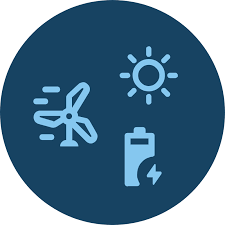

<!-- Improved compatibility of back to top link: See: https://github.com/othneildrew/Best-README-Template/pull/73 -->

<!--
*** Thanks for checking out the Best-README-Template. If you have a suggestion
*** that would make this better, please fork the repo and create a pull request
*** or simply open an issue with the tag "enhancement".
*** Don't forget to give the project a star!
*** Thanks again! Now go create something AMAZING! :D
-->

<!-- PROJECT SHIELDS -->
<!--
*** I'm using markdown "reference style" links for readability.
*** Reference links are enclosed in brackets [ ] instead of parentheses ( ).
*** See the bottom of this document for the declaration of the reference variables
*** for contributors-url, forks-url, etc. This is an optional, concise syntax you may use.
*** https://www.markdownguide.org/basic-syntax/#reference-style-links
-->

<!-- PROJECT LOGO -->
 

  

  <h3 align="center">Wind Energy Analytics Knowledge Exchange Space</h3>

  

   Learning resources for Python, Statistics and Machine Learning for Wind Energy Analytics -->
     
    <a href="https://github.com/kaiyaraby/wind_energy_analytics_ke/Python">View Python Resources</a>
    .
    <a href="https://github.com/kaiyaraby/wind_energy_analytics_ke/Statistics">View Statistics Resource</a>
    ·
    <a href="https://github.com/kaiyaraby/wind_energy_analytics_ke/Statistics">View Machine Learning Resources</a>
  

<!-- TABLE OF CONTENTS -->

  
Table of Contents

  <ol>
    <li>
      <a href="#about-the-project">About The Project</a>
      <ul>
        <li><a href="#built-with">Built With</a></li>
      </ul>
    </li>
    <li>
      <a href="#getting-started">Getting Started</a>
      <ul>
        <li><a href="#prerequisites">Prerequisites</a></li>
        <li><a href="#installation">Installation</a></li>
      </ul>
    </li>
    <li><a href="#usage">Usage</a></li>
    <li><a href="#roadmap">Roadmap</a></li>
    <li><a href="#contributing">Contributing</a></li>
    <li><a href="#license">License</a></li>
    <li><a href="#contact">Contact</a></li>
    <li><a href="#acknowledgments">Acknowledgments</a></li>
  </ol>

<!-- ABOUT THE PROJECT -->
# About The Project
This project aims to provide beginner-friendly resources and open-source code for people in the wind energy industry wanting to develop their digital and analytics skills. These will be delivered through Jupyter notebooks self-teaching and virtual discussion/teaching workshops with Python sessions delivered on odd weeks and stats/ML topics delivered on even weeks. For those wanting to be involved in the calls as well as the self-teaching materials, you can join the Microsoft Teams group [here](https://teams.microsoft.com/l/channel/19%3ApoooR5d8qFLE87TCQ3bcANQ4I4qhSRI5ujw9SyNpJpM1%40thread.tacv2/Main?groupId=006da0cd-1499-44f6-bc30-b0cc9acaa1c2&tenantId=38b40df8-b174-4f1a-baf8-e2f57646f856).

<!--Agenda -->
# Agenda

## Python Basics Course Outline

* Week 1: Introduction to Python Fundamentals
+ Variables and data types
+ Data structures (lists, tuples, dictionaries, sets)
+ Operators and expressions
* Week 3: Control Flow Statements
+ Conditional statements: if, elif, else
+ Loops: for, while
* Week 5: Functions
+ Defining and calling functions
Arguments, return values, and scope
* Week 7: Object-Oriented Programming
+ Creating and using classes
+ Understanding objects, attributes, and methods
* Week 9: Working with Common Python Libraries
+ Overview of (internally) commonly-used packages: numpy, scipy (inc. stats), scikit-learn, reliability
* Week 11: Data Access and Manipulation
+ Reading, writing, and processing data
+ Integrating Python with existing data architecture
* Week 13: Developing Reusable Code
+ Writing modular code and creating custom Python packages
* Week 15: Specialized Tools
+ Introduction to PyWake and its applications
* Week 17: Environment Management and Collaboration
+ Setting up virtual environments
+ Version control with Git
+ Basics of containerization (Docker)
 
## Statistics Module

* Week 2: Fundamentals of Statistical Distributions
+ Overview of common probability distributions
+ Understanding parameters and properties
* Week 4: Distribution Fitting
+ Maximum Likelihood Estimation (MLE) techniques
+ Goodness-of-fit assessments
* Week 6: Feature Engineering
+ Data preprocessing and transformation
+ Feature selection and extraction techniques
* Week 8: Statistical Estimators
+ Point and interval estimation
+ Bias, variance, and efficiency
* Week 10: Hypothesis Testing
+ Null and alternative hypotheses
+ Common tests (t-tests, chi-square, Wald test, Wilcoxon signed-rank test)
+ Selecting the appropriate test
+ p-values and statistical significance
* Week 12: Monte Carlo Simulations
+ Principles and applications
+ Random sampling and probabilistic modeling
* Week 14: Markov Chains
+ Basics of stochastic processes
+ Transition matrices and steady-state behavior
+ Monte Carlo simulations with Markov Chains

## Machine Learning Module

* Week 16: Introduction to Machine Learning in Wind Energy
+ Use cases in wind turbine performance and reliability
+ Challenges and data considerations
* Week 18: Neural Networks
+ Introduction to artificial neural networks
+ Fundamentals of architecture and training
* Weeks 20-24: Specialized Neural Architectures
+ Recurrent Neural Networks (RNNs)
+ Convolutional Neural Networks (CNNs)
+ Deep Learning methods:
* Week 24/25: Model Development and Optimization
+ Model selection techniques
+ Hyperparameter tuning strategies
* Week 26-28: Advanced Machine Learning Methods
+ Gaussian Process Regression (GPR)
+ Support Vector Machines (SVMs)
+ Polynomial Chaos Expansion (PCE)
+ Radial Basis Function Networks (RBFNs)
+ Dynamic Mode Decomposition (DMD) with ML integration
+ Bayesian Networks

<!-- CONTACT -->
# Contact

Kaiya Raby - kaiya.raby@nadara.com or raby.kaiya@gmail.com
[LinkedIn](https://www.linkedin.com/in/kaiya-raby/)
Project Link: [https://github.com/hacktheclimate]

(<a href="#readme-top">back to top</a>)

<!-- MARKDOWN LINKS & IMAGES -->
<!-- https://www.markdownguide.org/basic-syntax/#reference-style-links -->
[contributors-shield]: https://img.shields.io/github/contributors/othneildrew/Best-README-Template.svg?style=for-the-badge
[contributors-url]: https://github.com/othneildrew/Best-README-Template/graphs/contributors
[forks-shield]: https://img.shields.io/github/forks/othneildrew/Best-README-Template.svg?style=for-the-badge
[forks-url]: https://github.com/othneildrew/Best-README-Template/network/members
[stars-shield]: https://img.shields.io/github/stars/othneildrew/Best-README-Template.svg?style=for-the-badge
[stars-url]: https://github.com/othneildrew/Best-README-Template/stargazers
[issues-shield]: https://img.shields.io/github/issues/othneildrew/Best-README-Template.svg?style=for-the-badge
[issues-url]: https://github.com/othneildrew/Best-README-Template/issues
[license-shield]: https://img.shields.io/github/license/othneildrew/Best-README-Template.svg?style=for-the-badge
[license-url]: https://github.com/othneildrew/Best-README-Template/blob/master/LICENSE.txt
[linkedin-shield]: https://img.shields.io/badge/-LinkedIn-black.svg?style=for-the-badge&logo=linkedin&colorB=555
[linkedin-url]: https://linkedin.com/in/othneildrew
[product-screenshot]: images/screenshot.png
[Next.js]: https://img.shields.io/badge/next.js-000000?style=for-the-badge&logo=nextdotjs&logoColor=white
[Next-url]: https://nextjs.org/
[React.js]: https://img.shields.io/badge/React-20232A?style=for-the-badge&logo=react&logoColor=61DAFB
[React-url]: https://reactjs.org/
[Vue.js]: https://img.shields.io/badge/Vue.js-35495E?style=for-the-badge&logo=vuedotjs&logoColor=4FC08D
[Vue-url]: https://vuejs.org/
[Angular.io]: https://img.shields.io/badge/Angular-DD0031?style=for-the-badge&logo=angular&logoColor=white
[Angular-url]: https://angular.io/
[Svelte.dev]: https://img.shields.io/badge/Svelte-4A4A55?style=for-the-badge&logo=svelte&logoColor=FF3E00
[Svelte-url]: https://svelte.dev/
[Laravel.com]: https://img.shields.io/badge/Laravel-FF2D20?style=for-the-badge&logo=laravel&logoColor=white
[Laravel-url]: https://laravel.com
[Bootstrap.com]: https://img.shields.io/badge/Bootstrap-563D7C?style=for-the-badge&logo=bootstrap&logoColor=white
[Bootstrap-url]: https://getbootstrap.com
[JQuery.com]: https://img.shields.io/badge/jQuery-0769AD?style=for-the-badge&logo=jquery&logoColor=white
[JQuery-url]: https://jquery.com 
